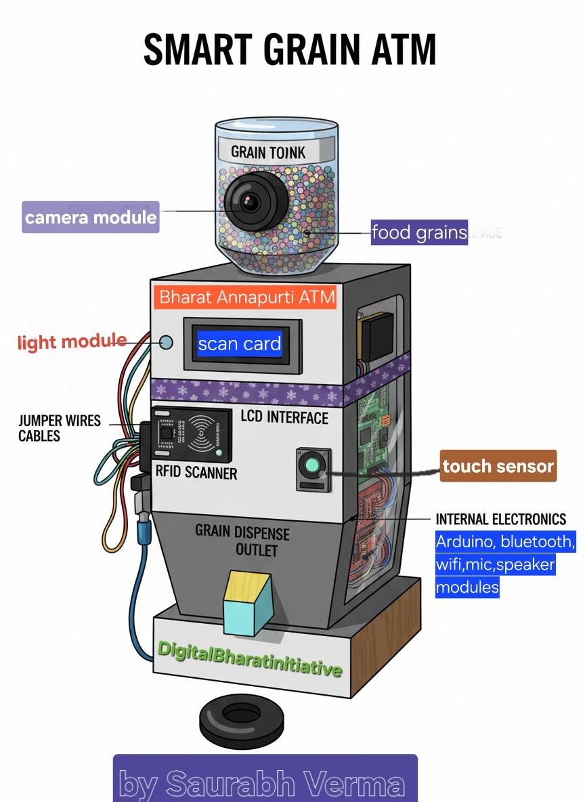

GranX: Smart Grain ATM

Prototype image showing the automated dispensing system in action.

Project Overview

GranX is an open-source, automated grain dispensing system designed to revolutionize India's Public Distribution System (PDS) by addressing key challenges such as corruption, inaccurate measurements, and limited accessibility in rural areas. By leveraging affordable IoT hardware, edge AI, and cloud connectivity, GranX ensures transparent, precise, and efficient distribution of essential grains like rice, wheat, and pulses.

This project aims to

Eliminate Fraud: Use RFID or Aadhaar-linked authentication to prevent unauthorized access.
Ensure Precision: Integrate load cells for accurate weighing, reducing wastage and disputes.
Enhance Accessibility: Support offline operations via GSM and provide vernacular assistance through an edge AI chatbot.
Enable Monitoring: Real-time data logging to cloud platforms and Bluetooth-enabled Android app for oversight.
Inspired by initiatives like the World Food Programme's Annapurti Grain ATM, GranX offers a low-cost, DIY alternative suitable for small-scale deployments in fair price shops, cooperatives, and community centers.

Key Features

Authentication: RFID-RC522 module for secure user verification.
Dispensing Mechanism: MG996R servo motors for controlled grain release.
Weighing: S-Type load cell with HX711 amplifier for high-precision measurements (up to 50kg capacity).
User Interface: I2C LCD display and touch sensors for intuitive operation.
Connectivity: ESP32 Wi-Fi for cloud sync; fallback GSM for offline areas; HC-05 Bluetooth for local monitoring.
Data Logging: Google Firebase integration for transaction records, inventory tracking, and analytics.
Edge AI Assistance: Offline chatbot using Small Language Models (SLMs) like Phi-2 or Gemma, running on Termux for voice/text queries in local languages (e.g., Hindi).
Power Efficiency: Low-power design suitable for solar-powered rural setups.
Scalability: Modular architecture for integration with larger PDS networks or 5G-enabled systems (inspired by Ericsson partnerships).
Impact and Social Relevance
In India, the PDS serves over 800 million beneficiaries but faces issues like 40-50% leakage due to manual errors and corruption (as per government reports). GranX can reduce this by automating processes, potentially saving billions in subsidies while ensuring equitable distribution. It's aligned with UN Sustainable Development Goals (SDGs) 2 (Zero Hunger) and 9 (Industry, Innovation, and Infrastructure).
Target Users: Fair price shop owners, cooperatives (e.g., under the World's Largest Grain Storage Plan), and government PDS outlets.
Pilot Potential: Ready for field testing in Uttar Pradesh (e.g., Lakhimpur district) or Odisha-style implementations.
Recognition: Winner of the INSPIRE MANAK Award for innovation in science and technology.
Hardware Requirements
Core Components
Microcontroller: ESP32-WROOM-32 (~₹300)
RFID Reader: MFRC522 (~₹100)
Load Cell: 50kg S-Type with HX711 (~₹400)
Servo Motors: 2x MG996R (~₹200 each)
Display: 16x2 I2C LCD (~₹150)
Touch Sensors: Capacitive modules (~₹50)
Bluetooth: HC-05 (~₹200)
Power Supply: 5V/12V adapters or solar panel integration
Estimated Build Cost
Prototype: ₹2,000-3,000 (excluding chassis)
Industrial Version: ₹10,000+ (with aluminum T-slot frame and professional PCB)
Sponsored by PCBWay for custom PCBs – see schematics for designs.
Software Architecture
Firmware
Developed in Arduino IDE (C++).
Main code: src/main.ino – Handles authentication, weighing, dispensing, and data sync.
Libraries Used: ESP32 core, MFRC522, HX711, Servo, LiquidCrystal_I2C, Firebase_ESP_Client.
Backend
Python scripts in python for data processing, AI model integration, and API endpoints.
Example: python/data_sync.py – Syncs local logs to Firebase.
Android App
Bluetooth-based monitoring app (built with MIT App Inventor or Android Studio).
Features: Real-time transaction view, inventory alerts, remote calibration.
Screenshots and APK coming soon in android.
Edge AI
Offline Chatbot: Tested with SLMs in Termux on Android/Raspberry Pi.
Code: python/offline_chatbot.py – Uses Hugging Face transformers for local inference.
Upcoming: Voice support via Speech-to-Text (e.g., Whisper-tiny).
Installation and Setup
Step-by-Step Guide
Clone the Repository:
git clone https://github.com/Svlmp347-star/smart-grain-atm.git
cd smart-grain-atm
Hardware Assembly:
Follow schematics/wiring_diagram.pdf for connections.
Mount components on a prototype board or 3D-printed chassis (STL files in schematics).
Calibrate load cell: Run calibration sketch in src/calibration.ino.
Firmware Upload:
Install Arduino IDE and ESP32 board support.
Open src/main.ino and upload to ESP32.
Configure Wi-Fi/Bluetooth credentials in code.
Cloud Setup:
Create a Firebase project and add credentials to firmware.
Set up realtime database for logs.
Testing:
Simulate dispensing: Use RFID card to authenticate, select quantity via touch, and verify weight.

Check Android app connection via Bluetooth.
For detailed troubleshooting, see docs/SETUP.md.
Roadmap 2026-2027
Phase 1 (Current): Prototype refinement with PCBWay sponsorship.
Phase 2 (Q1 2026): Industrial chassis, Raspberry Pi integration for advanced AI.
Phase 3 (Q2 2026): Field pilots with Pusa Krishi Incubator (applying for grant).
Phase 4 (Q3 2026): Open-source app release, integration with AgriStack/Digital Agriculture Mission.
Long-Term: Collaboration with WFP or Ericsson for nationwide scaling.
Applying for grants: Hack Club Blueprint (for hardware), RKVY-RAFTAAR (₹25 lakh seed), and Startup India Seed Fund.
Contributing
We welcome contributions! Whether it's code, hardware designs, documentation, or testing.
Guidelines: See CONTRIBUTING.md.
Issues: Report bugs or suggest features via GitHub Issues.
Pull Requests: Fork, branch, and PR with clear descriptions.

Funding and Support Needs

To scale GranX, we're seeking:
Funding: ₹5-25 lakhs for hardware (industrial load cells, 3D printing) and pilots.
Hardware: Donations of ESP32 boards, servos, or PCBs.
Software/Mentoring: Expertise in AI optimization or app development.
Incubation: Partnerships with agritech incubators like Pusa Krishi or MANAGE-CIA.
If you're from government (e.g., MoA&FW), CSR (e.g., HUL), or VCs (e.g., Omnivore), reach out! 
Budget Breakdown:
Hardware: 40% (₹10 lakhs)
Development: 30% (₹7.5 lakhs)
Pilots: 20% (₹5 lakhs)
Misc: 10% (₹2.5 lakhs)
Impact Metrics: Aim to deploy 100 units, benefiting 10,000 families, reducing leakage by 30%.

License
Licensed under Apache-2.0 – see LICENSE.
Contact

Developer: Saurabh Verma , Uttar Pradesh, India.
Email: svlmp347@gmail.com (assumed based on username).
LinkedIn: linkedin.com/in/saurabh-verma.

Acknowledgments

INSPIRE MANAK for initial recognition.
PCBWay for PCB sponsorship.
Open-source communities for libraries and inspiration.
This repository is actively maintained – last update: January 19, 2026.
This is a suggested improved and longer README.md. Copy-paste it into your repo, add missing files/folders as noted (e.g., create docs/, android/), and upload visuals. This version adds structure, guides, and funding details to make it more appealing for supporters. If you need code updates or more sections, let me know!